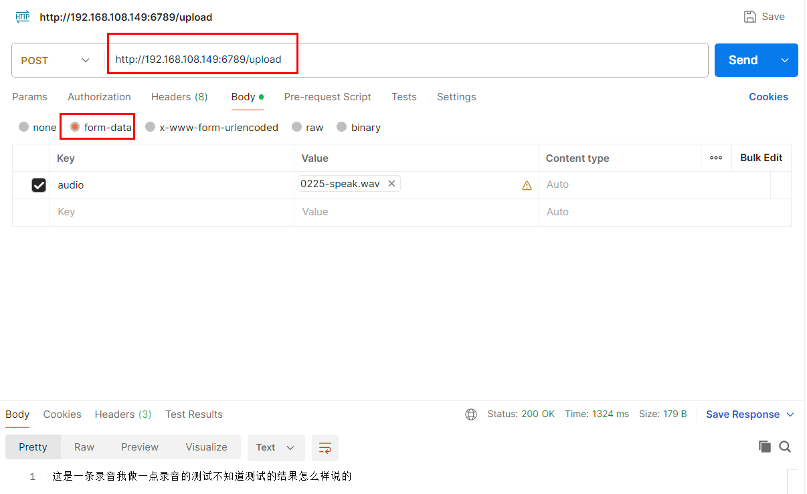

### 一、使用

这在板子上是完全能运行起来的，模型文件的转换就没再写了，其官方[demo](https://github.com/airockchip/rknn_model_zoo/blob/main/examples/zipformer/README.md)中有说。

注意：模型文件太大了，直接上传有问题，这个项目全部打包，放在阿里云盘，“备份文件->C++、Pyhton自己写好的Demo->RK3588”中的ASR-RK3588.zip

- 统一代码风格：`./format.sh` 
- 编译：
  - Release：`./build.sh`
  - Debug：`./build.sh 1`
- 运行：先进入install文件夹，cd install 
  - 识别指定音频文件：`./run.sh ./resources/test.wav`
  - 启动语音识别服务：`./run.sh`
    - 服务的ip地址为rk3588的IP地址；
    - 端口在main.cpp中指定为“6789”，可手动修改后，重新编译。
  - 停止服务：`./stop.sh`
  - 请求示例：
  
  

### 二、可借鉴的点

1. 用build.sh来完成cmake、make以及其他环境变量的准备，以后就这样写，通过运行./build.sh时加不加参数来决定是Release还是Debug版本，这样平时用就是Release，打断点开始自动就是Debug的版本，就不用去改什么东西。
2. 看./vscode文件夹中的tasks.json，就只有一个任务了，也就一个命令，即上面的"./build.sh 1", 不再是以往的cmake、make几个任务(几个任务会同时进行，所以一般第一次时因为cmake没完成，make也就会失败)，改成现在这样的一个shell脚本，就直接搞定。
3. 注意代码的统一格式化，使用format.sh与.clang-format的一起使用。

### 三、存在的问题

1. 处理的音频时长累计过长后，即生成大约一万两千个字符后，就开始结果错乱，未能解决，在rk3588笔记中有详细记录，也在官方提了一个[issue](https://github.com/airockchip/rknn_model_zoo/issues/287)。
2. 普通话识别效果还可以，但是一些专业词汇，带点口音，效果就大打折扣了。
3. 处理23分钟的音频文件，花费的总时长大约在3分40秒左右，效率还算OK，还是因为有其npu的加速。
4. 由于第一个原因，现在每次请求都是重新加载的模型文件，一次识别完成后就会释放所有资源，再请求就再加载。